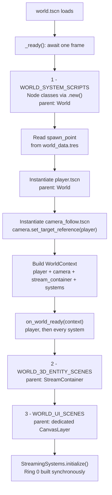
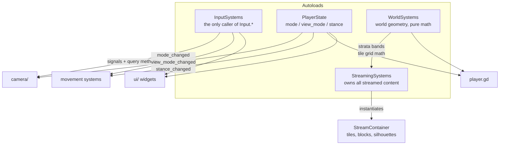
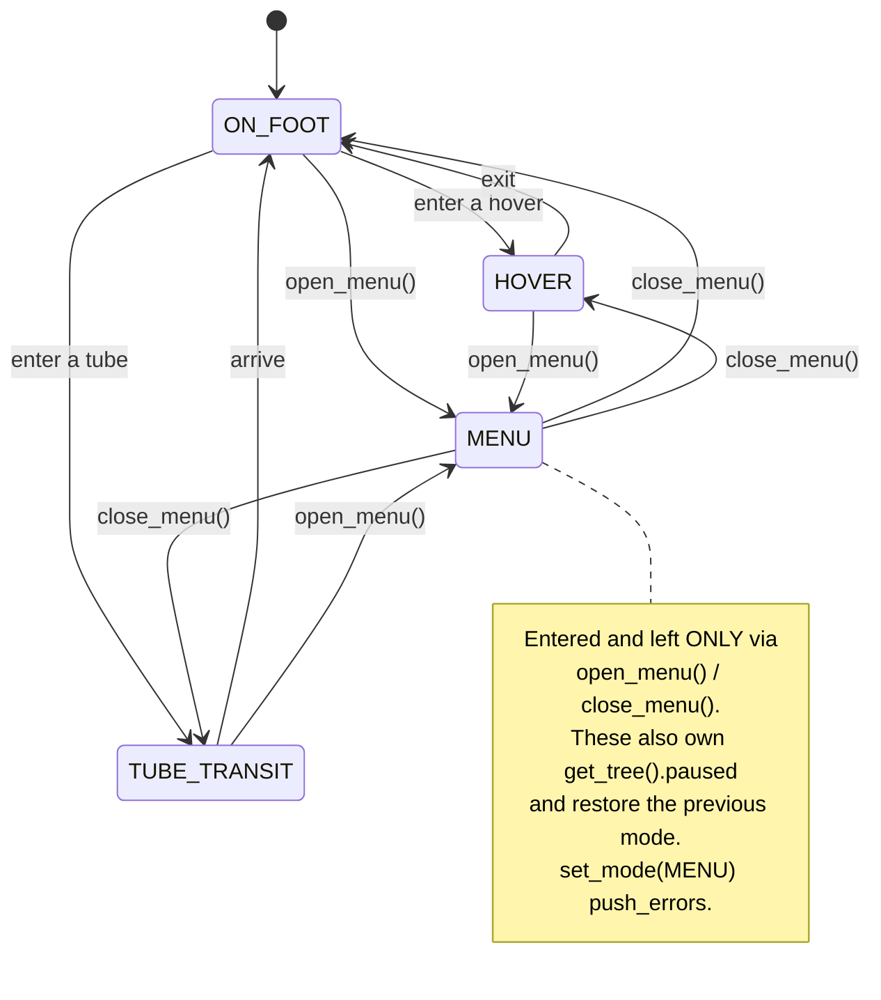
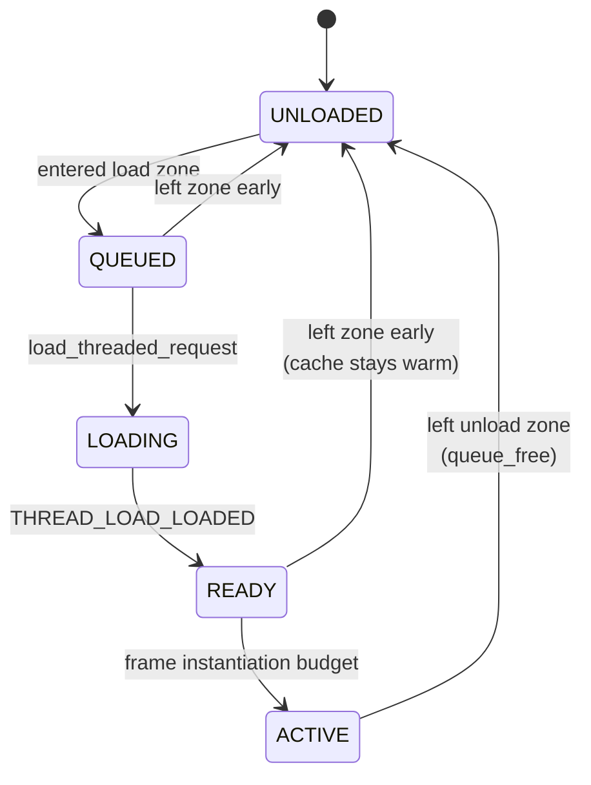
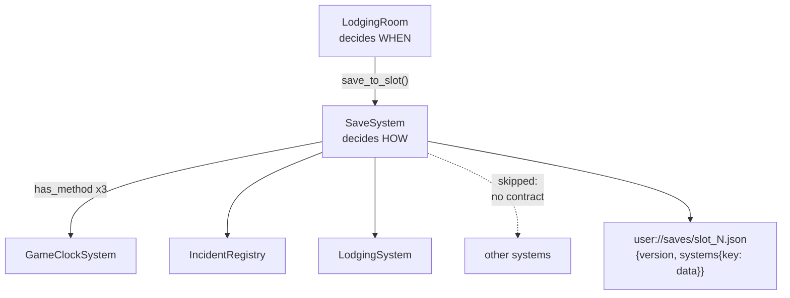

# Architecture

How this project is put together, and why it is put together that way.

This page is for **people**. It explains structure and reasoning, and it is
the right place to start if you have just been given access to the
repository. `../CLAUDE.md` covers the same system boundaries as a list of
rules to obey — it is a working brief for an AI tool operating in the
editor, not an introduction.

The diagrams below are [Mermaid](https://mermaid.js.org/) and render in
GitHub's file view directly. Nothing needs to be installed to read them.

Verified against `0b4001b`. Figures in this document — file counts, who
reads what — are stated as of that commit and will drift; the structure
they describe changes far more slowly.

---

## The shape of the thing

Roughly 20,000 lines of GDScript across ~97 scripts and ~256 scenes. Engine
is Godot 4.7, Forward+ renderer, targeting Intel HD 620 at ~55 FPS — that
hardware target is the reason behind a number of decisions that otherwise
look overly frugal.

Four ideas carry most of the weight:

1. **Four autoloads, and no more.** Global state is a closed set, not a
   convenience.
2. **`world.gd` is a composition root.** Systems are created and wired in
   one place, and that place does not grow as systems are added.
3. **`StreamingSystems` exclusively owns world content.** Nothing else
   instantiates a tile or a block, ever.
4. **Several contracts are duck-typed** — a system opts into a lifecycle by
   implementing a method, not by inheriting a base class or registering
   anywhere.

Point 4 is the one that catches people. Two separate mechanisms in this
codebase work by `has_method()` checks, and neither is visible from a class
hierarchy or an import graph. They are described in full below.

---

## Boot sequence

`world/world.tscn` is the startup scene. Everything alive at runtime is
brought up by `world/world.gd::_init_world()`, in a fixed order.



Three lists at the top of `world.gd` declare what exists. They are separate
lists rather than one because each category is constructed differently and
parented somewhere different: `.new()` under `World`, `.instantiate()` under
`StreamContainer`, `.instantiate()` under a `CanvasLayer`.

**Adding a system, a 3D entity or a UI scene is one line in the relevant
array.** The loops in `_init_world()` are fixed and do not grow. That is the
entire point of the arrangement.

### `on_world_ready(context)` — the first duck-typed contract

Anything in those three lists — plus the player — may implement:

```gdscript
func on_world_ready(context: WorldContext) -> void:
```

If the method exists it is called once, after the player, camera and all
systems exist. If it does not, the node is skipped silently. There is no
base class and no registration step; `world.gd` checks `has_method()` and
moves on.

`WorldContext` (`core/world/world_context.gd`) is a plain `RefCounted`
holding `player`, `camera`, `stream_container` and the list of live systems,
with `get_system(SomeClass)` for the case where a scene needs a specific
system rather than just the common references.

This exists so systems do not have to be hand-wired one by one in
`world.gd` with individual `register_player()` / `register_camera()` calls.
The cost is that the dependency is invisible to static analysis — you
cannot find it by searching for callers. That trade was made deliberately.

Twelve files implement `on_world_ready` today.

---

## Autoloads and who reads them

Four autoloads, each with one scope. Adding a fifth is off the table — see
`CONTRIBUTING.md`.



Approximate reach at `0b4001b`: `PlayerState` is read by 29 files,
`InputSystems` by 18, `WorldSystems` by 12, `StreamingSystems` by 4.

That last number is worth pausing on. The most complex subsystem in the
project is referenced by the fewest files — the streaming pipeline is
genuinely sealed behind `initialize()`, and `world.gd` knows nothing about
individual cells. If you are looking for a place where a change is likely
to be safe and local, that isolation is real.

`InputSystems` holds no game logic. It translates raw input into signals
(`primary_click_pressed`, `interact_pressed`) and query methods
(`is_jump_just_pressed()`, `get_move_axis()`), and never decides what an
input means. Subscribers decide, based on `PlayerState`. Two directories are
exempt and call `Input` directly: `core/map_source/` and `map_camera/`,
both editor-only level design tooling.

---

## PlayerState

The single source of truth for what the player currently is. Three
independent axes, deliberately not collapsed into one enum.



- **`Mode`** — `ON_FOOT`, `HOVER`, `TUBE_TRANSIT`, `MENU`. What the player
  is doing with their body.
- **`ViewMode`** — `TPS`, `ISOMETRIC`. Camera framing while on foot.
  `V` switches between them at the edges of the zoom range.
- **`Stance`** — `PEACE`, `COMBAT`, plus an `is_aiming` modifier on top of
  `COMBAT`. Declared intent, not equipment.

`MENU` is special and the reason `set_mode()` refuses it. Pause state and
mode must never disagree, so the two are changed together inside
`open_menu()` / `close_menu()`, and the previous mode is remembered and
restored — opening the menu inside a hover and closing it puts you back in
the hover, not on the pavement. Pause is set *before* the signal fires, so
every listener sees a consistent tree.

Stance is deliberately *not* reset by the menu: it is a statement about
intent, not part of the pause bookkeeping.

---

## World streaming

The most involved system here, and the one worth reading the file header of
(`core/world/streaming_systems.gd`) before touching anything.

Content exists in two rings.

**Ring 0 — silhouettes.** Built once in `initialize()`, synchronously,
before the first physics tick after the player spawns. Nine ground-tile
silhouettes plus one per block. These carry **permanent collision** — they
are the safety floor, and they never unload. While a cell's real content is
active its silhouette is merely hidden (`visible = false`); in Godot that
does not disable physics, so the collision stays live underneath.

**Ring 1 — content.** Streamed in and out around the player.



Two distance metrics, chosen per cell type:

- **Ground tiles** use a **ring metric** on grid coordinates (Chebyshev
  distance): loaded at ≤ 1 ring, unloaded at ≥ 2. Hysteresis is built into
  the metric — a whole tile of slack. A radius metric was tried and does not
  work here: tiles are 2200 m across, so any radius under half a tile
  unloads the ground under the player's feet.
- **Blocks** use an XZ **radius**: 1000 m to load, 1200 m to unload, the gap
  being the hysteresis. Blocks are full-height columns spanning the whole
  3200 m of gameplay height, so vertical filtering would be meaningless for
  them.

Scanning happens no more than once per 50 m travelled; the load/instantiate
pump runs every frame. Budgets are tight on purpose — 2 concurrent threaded
loads, **1** instantiation per frame. Background loading is cheap;
`instantiate()` + `add_child()` is what costs a frame. These numbers are
tuned to the hardware target and should not be changed without discussion.

### The strata layer name contract

Vertical detail is handled separately from streaming. A block's content
scene **must** contain `InstancePlaceholder` nodes named exactly:

```
LayerDoggerland     0–1000 m
LayerManifold    1000–2000 m
LayerGlare       2000–3200 m
```

For an active block, exactly one of these is materialised — the one matching
the player's current strata. Materialisation uses
`create_instance(replace = false, ...)`; `replace = false` is required so the
placeholder survives in the tree and the layer can be unloaded and
re-materialised later.

**This is a contract enforced by string matching, not by types.** Getting a
name wrong produces a warning and a missing layer at runtime — not a crash,
not a compile error. It is the single easiest thing to break silently in
this codebase.

---

## Saving

The second duck-typed contract, and structurally the same trick as
`on_world_ready`.

`SaveSystem` walks the live systems and moves dictionaries to and from disk.
That is its whole job — it knows nothing about *when* or *why* a save
happens. Something else decides that; today it is `LodgingRoom`, where
sleeping for a chosen number of hours is the in-fiction save point.

A system opts in by implementing all three of:

```gdscript
func get_save_key()  -> StringName
func get_save_data() -> Dictionary
func load_save_data(data: Dictionary) -> void
```

Implement all three and you are saved. Implement none and you are skipped
silently. Implement some but not all and you are skipped too — the check is
all-or-nothing.



Two decisions in here are load-bearing:

**`get_save_key()` exists so top-level keys are not class names.** Renaming
a script must not orphan a save file, so each system states its key
explicitly, independent of what its script is called this week.

**Every save carries a `version` field, from the very first save this
project ever produced.** A file with an unrecognised version is refused
outright — `push_warning`, nothing applied — rather than half-loaded. A save
format without a version field is a migration problem that can never be
fixed retroactively, so it was never allowed to happen.

Nothing but primitives, arrays and dictionaries leaves `get_save_data()`. No
`Node` references, no `Object` instances, no scene resource paths. If a
system cannot express its state that way, the system has a defect and the
contract does not widen to accommodate it. `IncidentRegistry` is the worked
example: it used to hold a `Node3D` reference to a perpetrator and had to
grow a stable id specifically in order to become saveable.

---

## Camera

`camera/camera_follow.gd` is a host. It owns the `Camera3D` and switches
which behaviour component is active based on `PlayerState.mode`:

- `on_foot_camera_component` — orbital/isometric and TPS, including the
  shoulder and combat lock-on sub-states
- `hover_camera_component` — chase and cockpit views, persisting across
  entering and leaving a vehicle
- `tube_transit_camera_component` — observer

Shake is a separate component with a specific structural property: it never
writes to the camera. It exposes pure getters, and the host adds their
result on top of a base transform recalculated from scratch every frame.
Because shake has no access to the camera's transform, it cannot leave a
residual offset behind after an effect ends — not by current behaviour, but
by construction.

Camera components read input exclusively through `InputSystems` query
methods.

---

## Player

`player/player.gd` owns physics, the animation state machine and rotation
directly, for both movement paths, gated on `PlayerState.view_mode`:

- **Click-to-move** (`ISOMETRIC`) — driven by `NavigationComponent`
- **Direct WASD** (`TPS`) — `TPSMovementSystem` feeds `set_direct_move_input()`
  every physics frame; `player.gd` applies velocity, rotation and animation

`player/player_components/` is component-per-concern. Check for an actual
`.gd` file before assuming a directory means working code — though note the
project rule that empty scaffolding directories are not created for
unstarted work, so what is there is generally real.

---

## World content data

`data/world_data.tres` is the declarative content list `StreamingSystems`
consumes: tile and block positions, content scene paths, silhouette scene
paths. The resource classes live in `world/resources/`.

**Editing world layout means editing data, not code.** The source of that
data is `map_source.tscn` — running that scene re-exports the resource.
Mass greybox generation lives in `tools/block_generator/`.

Markers prefixed `GBX_` are owned by the generator and **will be deleted**
on its next run. Rename to drop the prefix to make a marker hand-owned.

---

## Conventions that bite

- **Ground floor is world Y = 0.** Strata bands are read straight off
  `pos.y` with no offset. Strata transitions have 50 m of hysteresis so a
  player standing on a boundary does not flicker between them.
- **Tile coordinates are `Vector2i(col, row)`** — `.x` is the column along
  world X, `.y` is the row along world Z. Tile ids are `"gt_r%d_c%d"`,
  row first. The mismatch between the two orders is a genuine trap.
- **There is no test framework**, by decision. Verifying a change means
  running the project and reading Godot's output. The systems log their
  state transitions deliberately and verbosely for exactly this reason.
- **Most existing comments are Russian.** They are being translated header
  by header. New comments are English. If a Russian header stands between
  you and a change, ask rather than guess — those headers document
  invariants.

---

## Where to look first

| If you want to understand… | Read |
|---|---|
| What is safe to work on | `CONTRIBUTING.md` |
| Code conventions | `GDSCRIPT_STYLE.md` |
| What is being built right now | `scope_horizon.md` |
| What is intended but not started | `planned_scope.md` |
| Input bindings | `../input_map.md` |
| NPC reaction design | `NPC_REACTIONS.md` |
