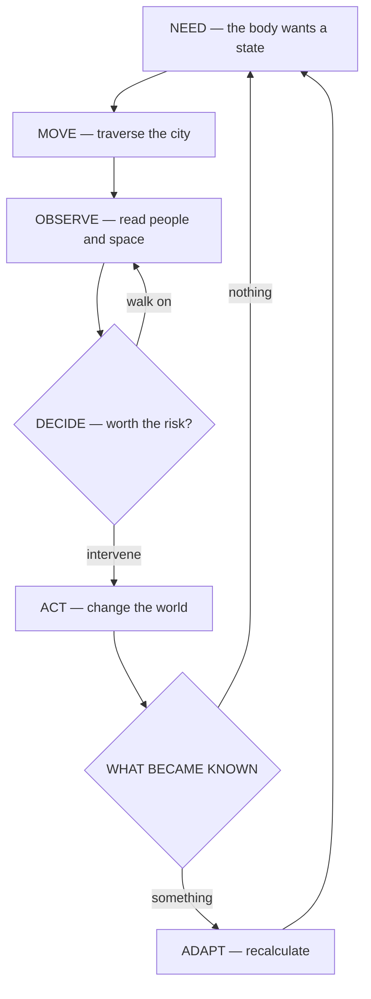
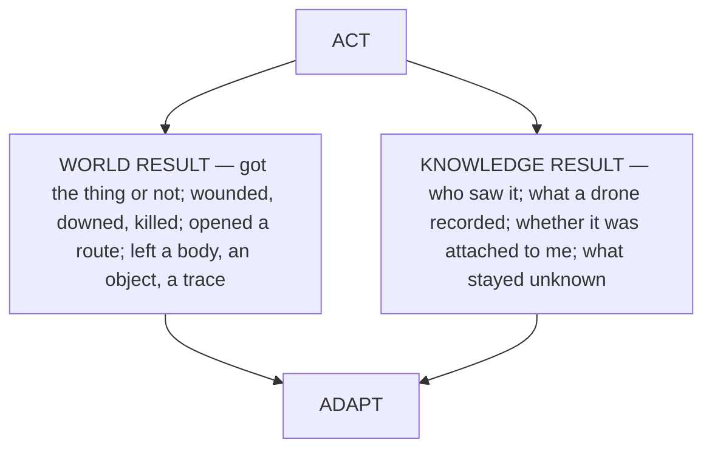
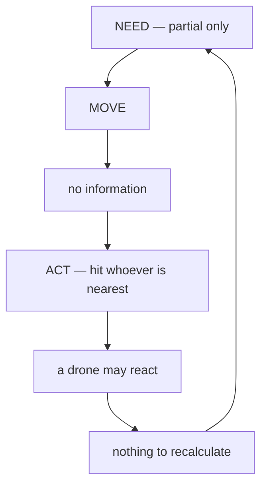

# Core loop

Why the player goes out, what they do minute to minute, and how much of it
is actually in the build.

Entry point for anyone joining the project. Read this first, then
`npc_archetypes.md` (what the crowd looks like), then `NPC_REACTIONS.md`
(what the crowd and the city do about it).

Verified against HEAD `24b36e6` — 2026-08-13

---

## In one sentence

> The player pursues a need through the physical city, reads incomplete
> information about people and surveillance, decides whether an intervention
> is worth its risk, acts with a deliberately narrow physical vocabulary,
> learns what the city made of it, and recalculates the next attempt.

---

## 1. The loop

**NEED** — the body or circumstance demands a state: eat, sleep, get money,
reach a place, get rid of a problem. Not a quest marker. A gauge crossed a
threshold and the thought is *I need money*.

**MOVE** — on foot or by hover. Stamina is the currency of the poor: lifts
and tubes cost money, stairs and running cost body.

**OBSERVE** — who is in front of you, whether they carry anything, whether
they are looking at you, who else is looking, and what gets recorded here.

**DECIDE** — whether an intervention is worth its price. Most of the time
the right answer is to walk on.

**ACT** — change the physical state of the world, understanding or
misjudging the cost of being seen. Hit, search, pick up, force with what is
at hand. No hacking, no disguise, no dialogue trees.

**WHAT BECAME KNOWN** — not "was I seen," but which part of what happened
became a fact to the city, and whether that fact is attached to me.

**ADAPT** — change route, time, place or method. Or accept that the next
attempt costs more.

### Why NEED is first

Without it, *move → look → choose → act* describes any immersive sim. The
need is what makes this one specific: the city does not hand out
objectives, the body does. Health, stamina, money, sleep. A gauge drops, so
money is needed, so who here can be taken. The body drives the cycle, not a
quest log.

The narrow verb set is a property of the character, not a poverty of design.
Sid is street-level, bottom rung; violence and improvised force are his
entire language. Widening that list means rewriting the character.

---

## 2. The core statement

> The player constantly decides on incomplete information about what the
> city sees and what it does not yet see.

Not stealth, not crime simulation, not surveillance drama — those are
components. The uncertainty is the game.

- **Consequences are evidence, not stars.** No wanted meter. What is
  punished is what was recorded.
- **After an intervention the question changes.** From "how do I do this" to
  "who knows that I did it."

---

## 3. Needs come in layers

Only the bottom layer belongs in the loop. The others exist and are felt,
but they are never tasks.

| Layer | What it is | In the loop? |
|---|---|---|
| Body | Hunger, fatigue, money, sleep | **Yes.** The only need that honestly closes, which is why it drives the cycle |
| Cost of closing it | There are faster, safer ways to get money than doing it yourself; they are paid for in dependence | Indirectly. The alternative always exists — robbing on your own is simply riskier |
| What he is in the city for | Never closes | **No.** Never surfaced as an objective |

Design rule, and it is load-bearing: **the body pushes, convenience
beckons, the top layer stays silent.** Nothing on the top layer is ever
issued as a task — no markers, no journal, no objectives.

The game serves the character's self-deception: the survival cycle is
itself a way of postponing what he came here for. A player who runs the
loop indefinitely is not stalling — they are doing exactly what he does.

**Risk to watch:** if NEED ends up being nothing but gauges, the game
becomes bar maintenance and the theme drowns in it. The guard is that
bodily pressure must be occasional and legible — a threshold, not a
constant tick. `HealthComponent` is already built that way.

---

## 4. Iris Access is where the layers meet

The eye is passport, wallet, key, identity and status in one — a single
object spanning the whole hierarchy. It pays for food, it opens doors, and
it is what identifies you.

It is a key to a cloud record, not a store. Access can be revoked remotely,
and the holder finds out at the door that did not open. Direct consequence
for OBSERVE: the player cannot check their own standing. They learn it from
a refusal.

---

## 5. An act produces two results

Not one branch — two independent ones. The player can win physically and
lose informationally, and the reverse.

Stole the money — success. Got identified — the price. Both branches feed
the recalculation.

---

## 6. What exactly became known

Four outcomes of the same punch in an alley:

| Outcome | State |
|---|---|
| Nobody saw it | No fact exists. The city still knows nothing about you |
| A witness saw the blow but not where you went | The event is known, the direction is not. Knowledge exists but leads nowhere |
| A camera recorded the event but did not link a face | The incident is in the registry, the actor is not established. Dangerous, but still anonymous |
| A drone recorded the incident and your identity | Actor attached to event. A different future |

`IncidentRegistry` already stores attribution — an actor id plus an event,
not merely an alarm flag. The code supports this granularity; what is
missing is any source of knowledge other than the drone.

### Asymmetry of knowledge

The player never gets an omniscient view. Knowledge lives in layers and they
do not agree:

- **Player** — "I think that guy saw me."
- **NPC** — "I saw an assault."
- **Drone** — "an incident is registered in this sector."
- **Registry** — "actor X is linked to incident Y."

No separate system is needed for this. The asymmetry already emerges from
`PerceptionComponent`, the drone's radius, and attribution in the registry.
It is written down here so it does not get flattened by accident.

---

## 7. What is in the build

| Stage | Built | Missing |
|---|---|---|
| NEED | `HealthComponent` with three bands; stamina capped by health; game clock; sleep in `LodgingRoom` | Hunger, wallet, rest as pressure — the status bar already reserves room for them |
| MOVE | Walk, run, jump, PEACE/COMBAT stance; hover; world streaming; day and night | Pneumatic tubes, metro, lifts |
| OBSERVE | `PerceptionComponent` on NPCs; `InteractComponent` — focus, object type and properties; HUD with status bar and key hints | **Crowd readability: nothing.** Every NPC is one mesh. See §8 |
| DECIDE | — | Nothing to choose between while passers-by are indistinguishable |
| ACT | Punch in COMBAT, aimed by the camera; `HealthComponent` shared by player and NPC: condition bands, bleeding and fracture as flags, drain on game-clock minutes, `died()`; terminal DOWN phase on NPCs at zero; pick up and carry; inventory with stacks and a weight limit | Searching a downed body; weapons; forced entry |
| WHAT BECAME KNOWN | `IncidentRegistry` with stable actor ids instead of node references; drone goes ALERT on a fact within radius, OBSERVE a rung below, addressed spotlight | Witnesses — NPCs report nothing; cameras; a durable wanted record |
| ADAPT | Sleep in `LodgingRoom`: advance the clock → notify `LodgingSystem` → write the save | Nothing to recalculate against: ALERT expires on a timer, consequences do not accumulate |

Save works: `SaveSystem` walks the world systems, the contract is three
optional methods (`get_save_key` / `get_save_data` / `load_save_data`)
checked via `has_method()` like the existing `on_world_ready()`. Keys are
not class names, so renaming a script does not orphan a file. The format
version is written from the first save and a foreign version is rejected
whole. No node references in the payload. Implemented by `GameClockSystem`,
`IncidentRegistry`, `LodgingSystem`.

**Short version: MOVE and ADAPT are a game. ACT is a prototype with a real
body. NEED is half there. OBSERVE is the only completely empty stage.**

---

## 8. The one blocking gap

Every NPC is the same mesh on the player's rig. Nothing about a passer-by
says whether they carry anything, whether they are watching, or whether
they would report it.

So the loop currently collapses in the middle:

**Until this is fixed there is nothing to test** — not the core statement,
not evidence-over-stars, not the 1/5/10 test below. No amount of behaviour
work compensates for an illegible crowd.

The fix is specified in `npc_archetypes.md`: five archetypes, four
readability channels, no profiler UI. Flat placeholder colours are
acceptable at prototype stage so the loop can be felt before meshes exist.

> **Closed 2026-08-26 (H3).** The archetypes and their channels are in, at
> placeholder-colour fidelity, and the loop above no longer collapses in the
> middle. The gap is closed as a *blocker*, not as finished work: silhouette
> and gait are still one mesh and one animation set, and the remaining
> fidelity is deferred past H6 — see `scope_horizon.md`. This section is kept
> because it states why the gap mattered, which is still the reason the
> archetypes exist.

This page said "six archetypes" until 2026-08-26; `npc_archetypes.md` and
`data/npc_archetypes/` have always had five (four on the two-axis grid, plus
Patrolman outside it). Corrected here rather than in the other direction.

---

## 9. Weak points

Named so they are not mistaken for oversights.

- **Consequence is ahead of the combat it measures.** An incident is
  recorded for a punch. Health and death exist, but killing costs nothing
  yet: no wanted state, no price on the head. There is nothing to tune the
  evidence rules against.
- **Knowledge does not propagate.** A drone that notices an incident does
  not alert another. Memory is a single timer. Nothing outlives the
  encounter, so there is nothing to recalculate against.
- **Navigation exists, but not for the ones who need it.**
  `NavigationComponent` was written for the player and is not wired to NPCs.
  Both the NPC and drone controllers substitute a forward raycast for a
  navmesh: an obstacle means "pick another point," not "route around it."
  Crowds cannot flow, patrols cannot pursue.
- **The stance/weapon axis is incomplete.** Stance is boolean;
  weapon-in-hand as an orthogonal modifier does not exist. A drone cannot
  tell a raised stance from a drawn weapon, which is why intent-based
  OBSERVE (`NPC_REACTIONS.md` §4a) is blocked.
- **Sleep and bleeding.** `HealthComponent` warns explicitly: sleep that
  fast-forwards time must call `suspend_conditions()` before the jump and
  `resume_conditions()` after, or `minute_passed` fires hundreds of times in
  a row and kills the player in the dark. Worth verifying against the
  current `LodgingRoom` wiring.

---

## 10. Height changes what OBSERVE means

Surveillance is a gradient, not a difficulty curve.

| Where | Coverage | The danger is |
|---|---|---|
| Caldera floor | Sparse, dark, tight | **People.** You read faces, posture, who is following |
| The shelf between the rims | Mixed | — |
| Outer rim and slope | Dense CCTV, open sightlines, narrow approved routes | **Infrastructure.** You read cameras and routes; the crowd stops being what is worth watching |

Same verb, different grammar. The inversion is deliberate: the safest place
to work is the place with the least protection for its residents — the
bottom is not watched because it is not counted.

The gradient is unchanged by the move to the island; what changed is that it
is now **continuous**, carried by the terrain, instead of three technical
bands. Doggerland, Manifold and Glare survive as what people in the city call
these places — in dialogue and text, never in code (see
`docs/island_rescope_brief.md`).

---

## 11. The 1 / 5 / 10 minute test

A build passes when the answers come from play, not from documentation.

**Minute 1 — what does the player learn to do?**
Read the street and move through it. No lore dump, no prompts. The start is
the caldera floor — what people call Doggerland — which means the first
minute is about the *absence* of attention: dark, crowded, nobody watching.
Not the reverse — cameras and drones at the start break the inversion.

**Minute 5 — what decision do they make?**
How to close a need without leaving a trace they cannot afford. A small
concrete situation, not a quest marker.

**Minute 10 — what changes their behaviour?**
The city learned something, and the old way of closing that same need no
longer works.

Where we are: minute 1 answers "walk." Minutes 5 and 10 have no answer yet.
Both are blocked by §8.

---

## 12. What this loop is not

- Not a menu of approaches. No seven ways through a door — there is one
  language, and the only question is whether to use it.
- Not a wanted meter with better wording.
- Not stealth. Being seen is normal; the problem is being *linked to the
  act*.
- No planning phase. No menu for studying a target and picking an approach —
  planning happens on the move, out of incomplete information: saw, judged,
  decided, did.
